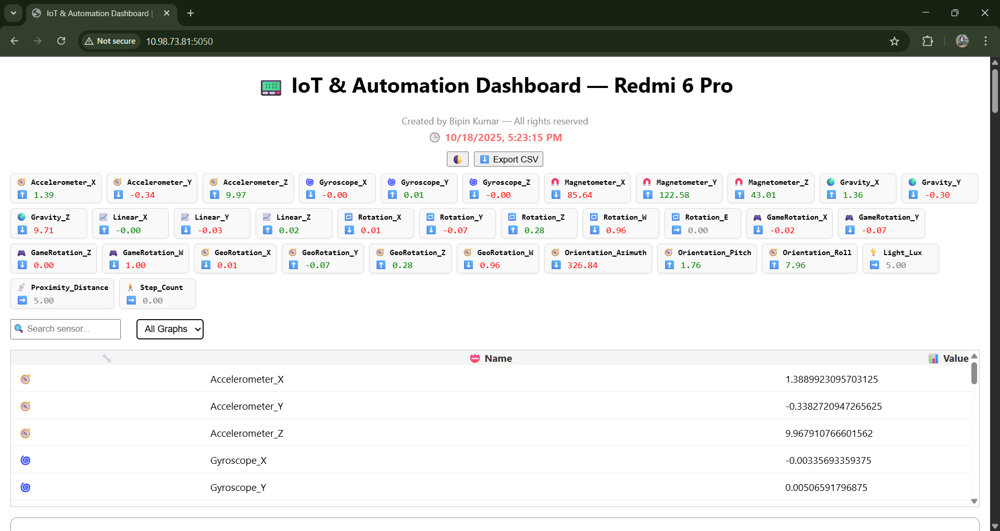
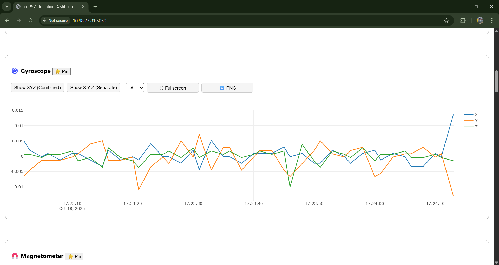

````markdown
# IoT Phone Sensor Dashboard (Only Android is used)

This project **upcycles an abandoned Android phone** into a powerful, real-time IoT sensor hub.

It reads all on-board sensors (like the Accelerometer, Gyroscope, and Light sensor) using Termux and streams the data to a robust web dashboard. The entire system—both the data logger and the web server—runs intelligently in separate environments on the same phone.

---

## 💡 Motivation

The goal of this project was to create a low-cost, accessible IoT monitoring system by **upcycling old hardware**. This entire system runs on an abandoned Android phone, using Termux and a virtual Ubuntu environment to host a complete web application and data pipeline. It proves that powerful IoT solutions don't require expensive, specialized hardware, just the creative use of everyday technology.

---

## 🏛️ Architecture

The system runs in two separate environments on the same phone to ensure stability and separation of tasks:

1.  **Termux (Main):** Runs a lightweight data logger (`logger.py`) to read sensors and stream data.
2.  **Virtual Ubuntu (proot):** Runs the full dashboard (`dashboard.py`) inside a dedicated Python virtual environment, providing a stable server for the web UI.
---

## 📸 Screenshots

Here is a look at the dashboard in action.

**Main Dashboard View:**


**Live Sensor Cards & Table:**


**Pinned Sensors & Dark Mode:**


---

## 🌊 Project Flowchart

This diagram shows how data flows from the phone's hardware to your browser.

```mermaid
graph TD
    subgraph Phone (Termux)
        A[Phone Sensors] --> B(scripts/logger.py);
        B --> C[Stream @ :5000];
    end

    subgraph Phone (Virtual Ubuntu)
        D(app/dashboard.py) --> E{routes.py Proxy};
        E --> C;
    end

    F[Your Browser] --> G(View @ :5050);
    G --> D;
````

-----
## ✨ Features

* **Real-Time Data:** Streams sensor data from Termux to the web dashboard using Server-Sent Events (SSE).
* **Auto-Reconnecting:** The dashboard automatically detects connection loss (e.g., if the logger crashes) and attempts to reconnect every 3 seconds.
* **Interactive Plotly.js Charts:**
    * Toggle between **Combined (XYZ)** or **Separate (X, Y, Z)** axis views.
    * Filter to view individual axes (e.g., just X or Y).
    * **Fullscreen mode** for detailed analysis.
    * **Download any chart as a PNG image.**
* **Live-Updating Table:** A searchable table of all sensor values, updated in real-time.
* **Live Trend Cards:** At-a-glance cards showing sensor values and their trends (⬆️ ⬇️).
* **Dynamic UI:** Pin your favorite sensors, filter by sensor, search all values, and toggle dark mode.
* **Dual-Environment Architecture:** A `logger.py` script in Termux streams raw data, while the `dashboard.py` in Ubuntu serves the UI, eliminating cross-origin (CORS) issues.
* **CSV Export & Logging:** The Termux script saves all data to a `.csv` file, which can be exported from the dashboard.
* **Automated Startup:** A single `start.sh` script handles starting both servers in their correct environments.

-----

## 🗂️ Project Structure

```
redmiedge-iot-project/
├── app/                  # Main Ubuntu Flask web application
│   ├── static/           # CSS and JavaScript files
│   ├── templates/        # dashboard.html
│   ├── dashboard.py      # Main app entry point (runs on :5050)
│   └── routes.py         # Proxy routes that talk to the logger
├── assets/               # Stores screenshots and diagrams
│   ├── screenshot-dashboard.png
│   └── ...
├── data/                 # Stores logged sensor data (Ignored by .gitignore)
├── logs/                 # Stores all runtime logs (Ignored by .gitignore)
├── scripts/              # Scripts to be run in Termux
│   └── logger.py         # Data logger & sensor streamer (runs on :5000)
├── venv/                 # Ubuntu's Python venv (Ignored by .gitignore)
├── .gitignore            # Tells Git what files to ignore
├── requirements-termux.txt   # Libraries for Termux
├── requirements-ubuntu.txt   # Libraries for Ubuntu venv
├── start.sh              # Automates starting both servers
└── stop.sh               # Automates stopping both servers
```

-----

## 🚀 How to Run (On-Phone)

This project is designed to be run entirely from your phone's Termux terminal.

### Prerequisites

1.  **Termux Environment:**
    ```bash
    pkg update
    pkg install python termux-api proot-distro
    pip install -r requirements-termux.txt
    ```
2.  **Virtual Ubuntu Environment:**
      * Install Ubuntu: `proot-distro install ubuntu`
      * Log in: `proot-distro login ubuntu`
      * Inside Ubuntu, install Python & create your venv:
        ```bash
        apt update
        apt install python3 python3-venv
        cd /root/redmiedge
        python3 -m venv venv
        ```
      * Activate the venv (`source venv/bin/activate`) and install libraries:
        ```bash
        pip install -r requirements-ubuntu.txt
        ```
      * Type `exit` to return to Termux.

### Running the Project

1.  **Make Scripts Executable (One-Time Setup):**
    From your main project folder in Termux, run:

    ```bash
    chmod +x start.sh
    chmod +x stop.sh
    ```

2.  **Start the Servers:**

    ```bash
    ./start.sh
    ```

    Your terminal will run the script and finally "get stuck" running the `dashboard.py` server. **This is correct.** It means the dashboard is running.

3.  **View Your Dashboard:**
    Leave the terminal running. On another phone or computer connected to the **same WiFi**, open a browser and go to:

    **`http://YOUR_PHONE_IP:5050`**

    *(Find your phone's IP by running `ifconfig` in a new Termux tab).*

4.  **Stop the Servers:**
    Go to the "stuck" terminal and press **`Ctrl` + `C`**. Then, run your stop script to shut down the logger:

    ```bash
    ./stop.sh
    ```

<!-- end list -->

```
```

